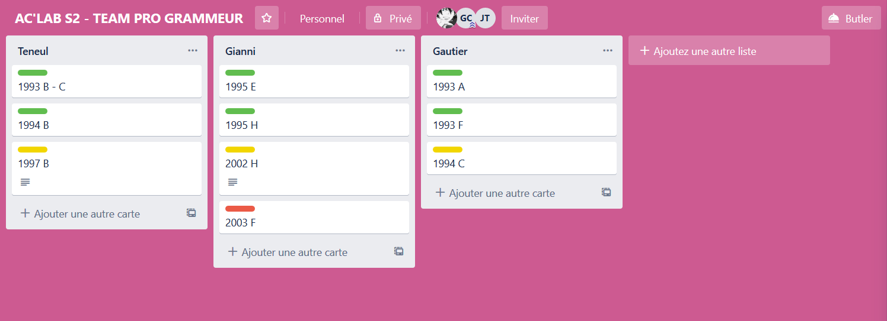

# Projet Ac'Lab

## Description

Dans le cadre du Semestre 6 de la Licence des Sciences du Numérique (FGES - Université Catholique de Lille), promotion 2020, nous avons travaillé sur sujets disponibles sur le lien suivant : https://icpc.baylor.edu/worldfinals/problems

Encadrés par Mme Julie JACQUES et Mr Nicolas GOUVY, nous devions faire le maximum de sujet afin de nous améliorer en algorithmie et tester nos capacités de réflexion.

## Technologies

Le langage à utiliser pour chaque sujet étant libre, nous avons dans la plupart des cas opté pour le langage C et le langage Python.

## Organisation

### Agilité

Dans la continuité de notre apprentissagee, nous avons  traité les problèmes selon des tâches définies selon un processus agile.

<!-- Expliquer ici notre organisation agile -->

### Trello

Nos tâches sont disponibles via le trello accessible à l'adresse suivante : https://trello.com/b/08augKsk/aclab-s2-team-pro-grammeur

Voici une capture d'écran du trello afin de donner un aperçu :

Comme vous pouvez le voir, nous avons opté pour un **code couleur** et avons délaissé le "to do, in progress and done" trop verbeux pour ce type de projet.

Ainsi, chaque colonne correspond à un étudiant et chaque tâche correspond à un sujet.

Les étiquettes correspondent au status du sujet :

 `Sujet terminé`

 `Sujet en cours`

 `Sujet prévu`

  <i>Authors: Julien TENEUL Gautier COUTURE Gianni GIUDICE 

